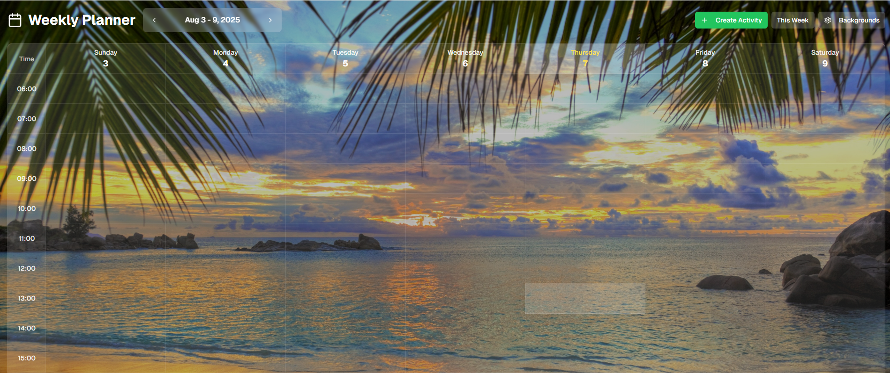

# 🗓️ TodoApp – Weekly Planner

A visually stunning **calendar-based Todo application** built with **Next.js**, **React**, and **Tailwind CSS**.  
Plan your week, set priorities, and enjoy a customizable background experience.



## 🚀 Live Demo
🔗 **[View Live on Vercel](https://todo-app-nine-flax-19.vercel.app/)**

---

## ✨ Features

- **📅 Weekly Planner Layout** – Organize tasks in a clean, calendar-style view.
- **➕ Add & ✏️ Edit Tasks** – Quickly create and modify your activities.
- **✅ Mark as Done** – Keep track of completed tasks easily.
- **⭐ Importance Levels** – Assign star ratings (1–3) to prioritize tasks.
- **🎨 Custom Backgrounds** – Choose from a set of curated images or upload your own.
- **🌐 Responsive Design** – Works perfectly across desktop and mobile devices.
- **🖌 Transparent Interface** – Calendar seamlessly blends with your chosen background.

---

## 🛠️ Tech Stack

- **Framework:** [Next.js](https://nextjs.org/)
- **UI Library:** [React](https://react.dev/)
- **Styling:** [Tailwind CSS](https://tailwindcss.com/)

---

## 📦 Installation

1. **Clone the repository**
   ```bash
   git clone https://github.com/DenizS4/TodoApp.git
   cd TodoApp
   Install dependencies

2. **Install dependencies**
   ```bash
   npm install

3. **Run the project**
   ```bash
   npm run dev

3. **Open the project**
   ```bash
   http://localhost:3000
